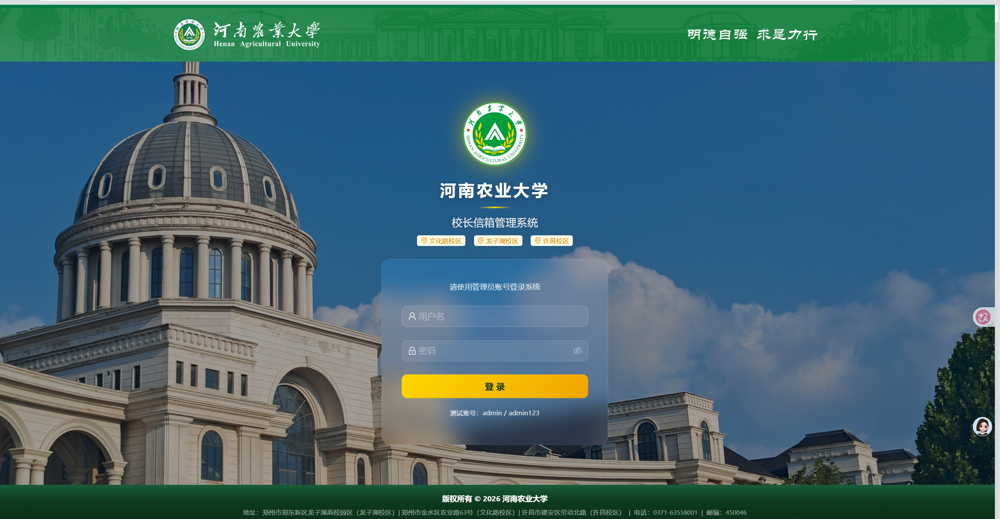
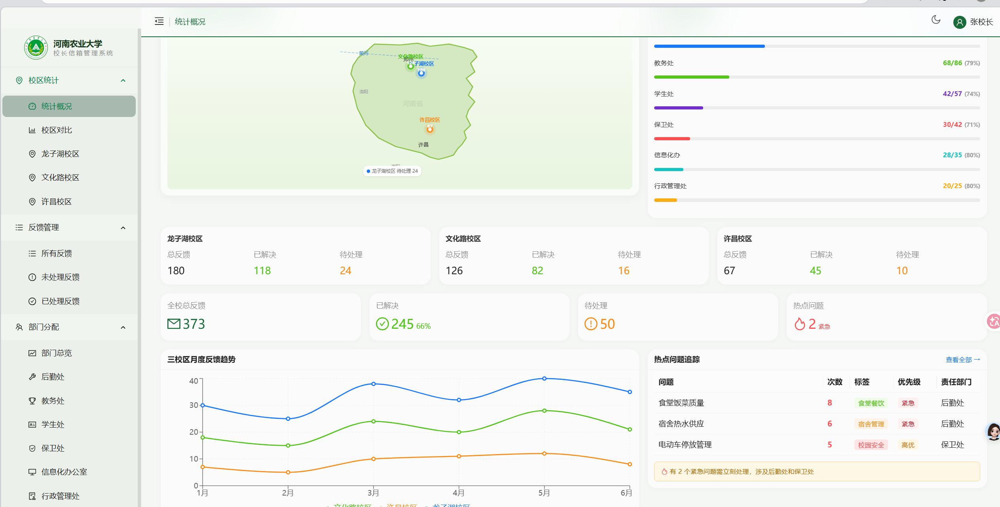

# 河南农业大学 · 校长信箱管理系统

## 📖 项目简介

校长信箱管理系统是河南农业大学内部使用的反馈管理平台，覆盖 **龙子湖校区、文化路校区、许昌校区** 三大校区。系统为校领导及各职能部门提供集中式的师生意见收集、处理、跟踪与统计功能。
  
### 核心功能

- **📊 仪表盘** — 全校反馈数据总览，包括各校区统计、分类分布、处理进度等
- **🏫 校区分屏** — 龙子湖 / 文化路 / 许昌三个校区的独立数据面板
- **📬 信箱反馈** — 师生提交的意见与建议汇总，支持按标签、状态筛选
- **✅ 已解决 / ❌ 未解决** — 按处理状态分类管理反馈事项
- **🏢 部门管理** — 六大职能部门（后勤处、教务处、学生处、保卫处、信息化办公室、行政管理处）的独立视图
- **🔥 热点问题** — 高频反馈问题的集中展示与追踪
- **🎨 主题切换** — 支持亮色 / 暗黑 / 玻璃三种界面风格
- **🔐 登录认证** — 管理员账号登录，受保护路由

### 技术栈

| 类别 | 技术 |
|------|------|
| 前端框架 | React 19 |
| UI 组件库 | Ant Design 6 |
| 路由 | React Router 6 |
| 图表 | Recharts |
| 构建工具 | Create React App (react-scripts 5) |

---

## 📦 关于依赖文件（node_modules）

`node_modules/` 是项目的依赖包目录，由 `npm install` 自动生成。

| 项目 | 说明 |
|------|------|
| 位置 | 项目根目录下的 `node_modules/` |
| 大小 | 约 **663 MB** |
| 已忽略 | ✅ 已在 `.gitignore` 中配置，不会被 git 上传 |
| 可删除 | ✅ **可以安全删除**，不影响源代码 |
| 恢复方式 | 删除后执行 `npm install` 即可重新下载 |

**分享/上传项目时只需保留源代码**，无需包含 `node_modules/`。对方克隆后执行 `npm install` 即可自动安装所有依赖。

---

## 🚀 快速启动

### 环境要求

- **Node.js** >= 16.x
- **npm** >= 8.x

### 1. 安装依赖

```bash
npm install
```

### 2. 启动开发服务器

```bash
npm start
```

浏览器自动打开 [http://localhost:3000](http://localhost:3000) 即可访问。

### 3. 登录系统

| 用户名 | 密码 |
|--------|------|
| `admin` | `admin123` |

---

## 🖼️ 项目展示

> 截图存放于 `screenshots/` 目录下，将你的截图文件放入该文件夹并替换下方路径即可。






---

## ⚙️ 项目配置

### 默认账号

账号密码在 `src/context/AuthContext.js` 中硬编码：

```js
// 第 12 行
if (username === 'admin' && password === 'admin123') {
```

如需修改，直接编辑该文件中的 `username` 和 `password` 即可。

### 部门与数据

所有部门信息、校区选项、反馈标签、状态枚举以及演示统计数据均位于：

```
src/constants/index.js
```

修改该文件即可调整部门列表、联系方式、标签分类等内容。

### 主题配置

三种主题模式（亮色 `light` / 暗黑 `dark` / 玻璃 `glass`）通过 `ThemeContext` 管理，用户的选择保存在 `localStorage` 的 `mailbox_theme` 键中。

主题配色（主色 `#007A44` 等）在 `src/App.js` 的 `antdTheme` 对象中配置。

### 生产构建

```bash
npm run build
```

构建产物输出到 `build/` 目录，可直接部署到任意静态服务器或 CDN。

---

## 📁 项目结构

```
src/
├── App.js                          # 根组件（路由 + 主题）
├── App.css                         # 全局样式
├── context/
│   ├── AuthContext.js              # 登录认证上下文
│   └── ThemeContext.js             # 主题切换上下文
├── components/
│   ├── GlobalShell.js / .css       # 全局外壳（玻璃拟态背景）
│   ├── MainLayout.js               # 主布局（侧边栏 + 顶栏）
│   ├── CampusTemplate.js           # 校区通用模板
│   ├── DeptTemplate.js             # 部门通用模板
│   └── HenanMap.js                 # 河南地图组件
├── pages/
│   ├── Login.js                    # 登录页
│   ├── MailboxDashboard.js         # 仪表盘首页
│   ├── HotIssues.js                # 热点问题
│   ├── DepartmentManage.js         # 部门管理
│   ├── campus/
│   │   ├── CampusStats.js          # 校区统计总览
│   │   ├── LongzihuCampus.js       # 龙子湖校区
│   │   ├── WenhuaRoadCampus.js     # 文化路校区
│   │   └── XuchangCampus.js        # 许昌校区
│   ├── feedback/
│   │   ├── MailboxFeedback.js      # 信箱反馈
│   │   ├── UnresolvedFeedback.js   # 未解决反馈
│   │   └── ResolvedFeedback.js     # 已解决反馈
│   └── departments/
│       ├── Overview.js             # 部门总览
│       ├── Houqin.js               # 后勤处
│       ├── Jiaowu.js               # 教务处
│       ├── Xuesheng.js             # 学生处
│       ├── Baowei.js               # 保卫处
│       ├── Xinxihua.js             # 信息化办公室
│       └── Xingzheng.js            # 行政管理处
└── constants/
    └── index.js                    # 常量配置（部门/标签/状态等）
```

---

## ⚠️ 免责声明

> **重要提示：本项目为纯前端项目，仅用于界面展示，无后端服务、无数据库、无真实数据。**

1. **纯前端项目**：本项目目前仅包含前端界面代码，**没有后端 API、没有数据库连接、没有服务端逻辑**。所有页面展示的数据均为前端硬编码的静态模拟数据。

2. **数据仅展示用途**：系统中所有的部门信息、统计数据、反馈记录、联系方式、姓名、电话、邮箱等**全部为虚构的演示数据**，仅用于填充界面、展示 UI 效果，**不代表河南农业大学的任何真实业务信息**。数据来源为 `src/constants/index.js` 中的静态 JavaScript 对象。

3. **非官方系统**：本项目并非河南农业大学官方发布或授权的系统，与河南农业大学及其任何下属部门无关联。校名、校区名称等仅用于界面演示场景。

4. **安全警告**：当前登录认证为前端硬编码的简单字符串比对（`admin/admin123`），**不具备任何实际安全性**，切勿用于生产环境。

5. **无担保声明**：本项目按"现状"提供，不提供任何明示或暗示的担保。使用者需自行承担使用风险，开发者不对因使用本项目产生的任何直接或间接损失负责。

6. **知识产权**：项目中使用的图片资源（如 `public/` 目录下的 `.jpg`、`.png`、`.webp` 文件）版权归原作者所有。如涉及侵权，请联系删除。

---

## 📄 可用脚本

| 命令 | 说明 |
|------|------|
| `npm start` | 启动开发服务器（端口 3000） |
| `npm run build` | 生产环境构建 |
| `npm test` | 运行测试（交互式监视模式） |
| `npm run eject` | 弹出 CRA 配置（**不可逆操作**） |

---

## 📝 License

本项目仅供学习参考，不开放商业使用授权。
